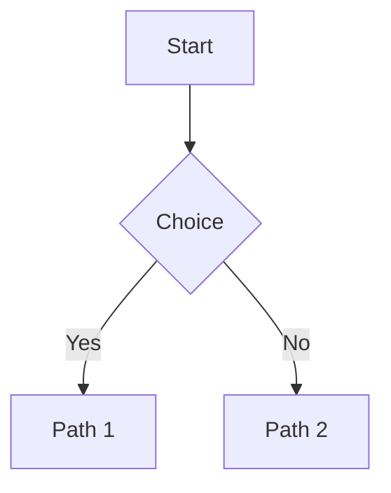

# Fixture Document

This is a sample markdown with an image and a link.

Visit https://example.com for more info.

## Section

- Item 1
- Item 2

## Diagram

```mermaid
graph TD;
  A[Start] --> B{Choice};
  B -- Yes --> C[Path 1];
  B -- No --> D[Path 2];
```

